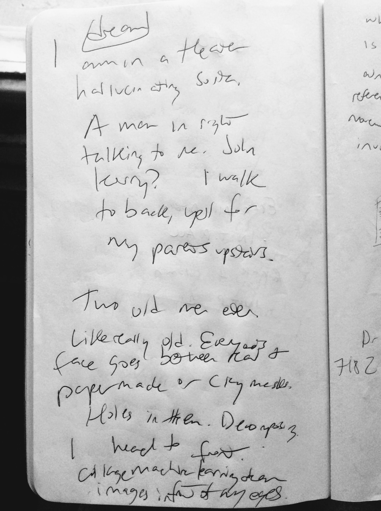

<!doctype html>
<!-- today's soundtrack: Four Tet New Energy and Parallel -->
<html lang="en">
<head>

  <meta charset="utf-8">
  <meta name="keywords" content = "Project, Art, dreams, prototype" />
  <meta name="description" content="LeeSD Dream Emulator"
  <meta name="author" content="The Webmaster">
  <meta name="viewport" content="width=device-width, initial-scale=1.0">

  <link rel="shortcut icon" type="image/jpg" href="favicon.ico"/>

  <link rel="stylesheet" href="style.css">

  <title>
 LeeSD Dream Emulator 
  </title>

</head>

<body>

  <xmp theme="style.css" style='display:none;'>
  # LeeSD Dream Emulator

  Based on an idea that percolated up from the back of my mind, as all good art ideas do (?). I have not played the original 1998 beloved and cult classic LSD Dream Emulator by Osamu Sato as far as I can remember. But I have watched youtube videos, read numerous articles, and it remains hugely influential. I decided to download a Playstation Emulator to try it out, but before I do so, I will create my own *dream emulator*, based on my own dreams.

  For the past month, I have been collecting my own dreams in a journal next to my bed. Sometimes I half-wake up and jot them down. I have never done this previously in my life, and have historically not been able to remember my dreams upon waking. Writing down and being able to relive these dreams afterwards has been a pleasant if open-ended experience. What does one do with dreams?

  For now, I am translating them to my own dream emulator, perhaps as one way of processing them. When I finish, I will play the original reference.

  

  This page is being built prior to making the project. I can't remember where I read this suggestion several years ago, but I'm trying it out.

  *If you will it, it is no dream.*

  Also, a tribute to the hypnagogic states described by Aphex Twin while creating Selected Ambient Works.

</xmp>

  
  
</body>
</html>
